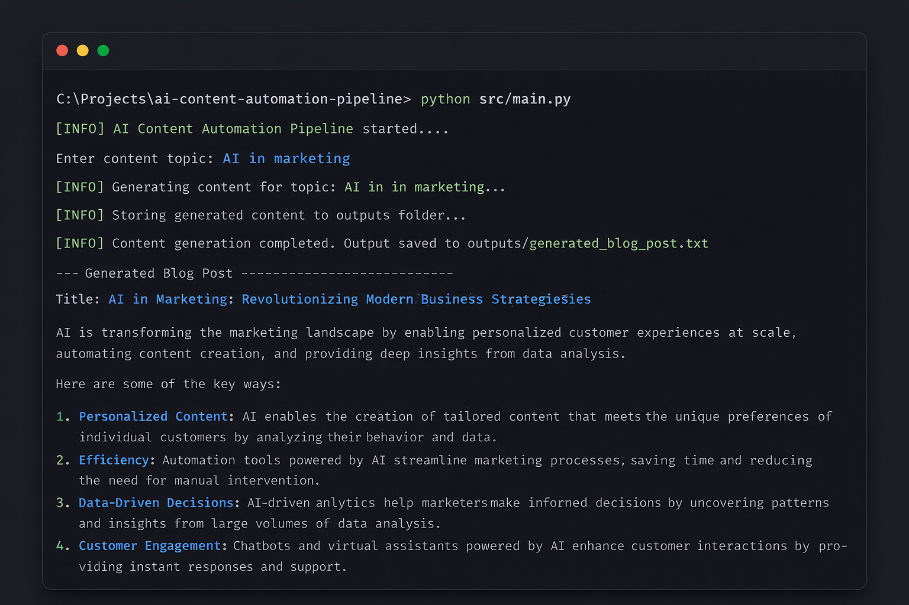

AI Content Automation Pipeline

📸 Demo

Example of the pipeline generating AI-powered marketing content in real time.

AI-powered content generation pipeline designed to automate marketing workflows, improve productivity, and enable scalable content strategies using Large Language Models (LLMs).

🚀 Overview

This project demonstrates how AI can be integrated into marketing operations to automate content creation at scale.

The pipeline receives a topic as input, generates structured marketing content using AI, and stores the output automatically — simulating a real-world content production workflow.

💼 Use Case

This system can be used by:

- Marketing teams to automate content generation
- Agencies to scale client content production
- Businesses looking to reduce manual workload
- Startups aiming for fast content execution

💡 Example:
A company can generate blog posts, social media captions, or campaign ideas in seconds instead of hours.

⚙️ Features

- AI-generated marketing content
- Prompt-based content strategy
- Automated file output generation
- Scalable pipeline structure
- Easy integration with APIs and other tools

🧠 Tech Stack

- Python
- OpenAI API
- dotenv
- Modular architecture

📂 Project Structure
